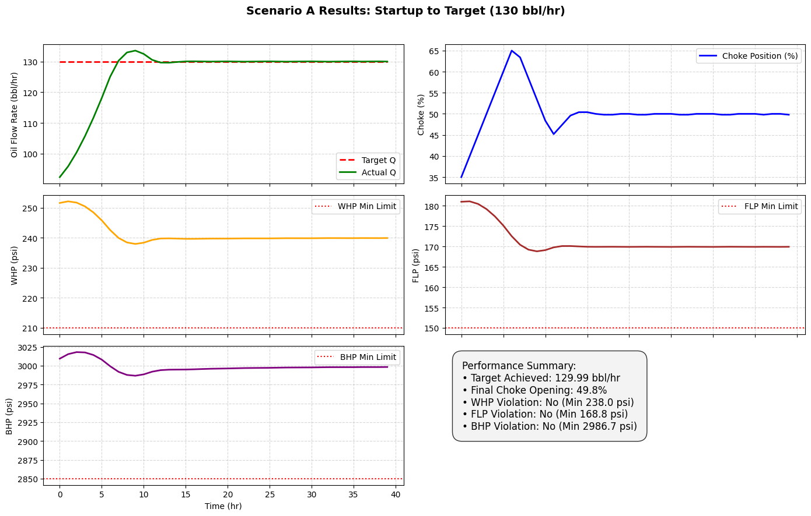
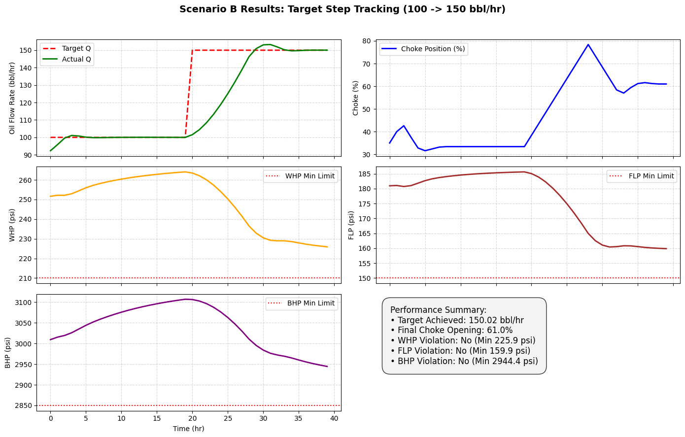
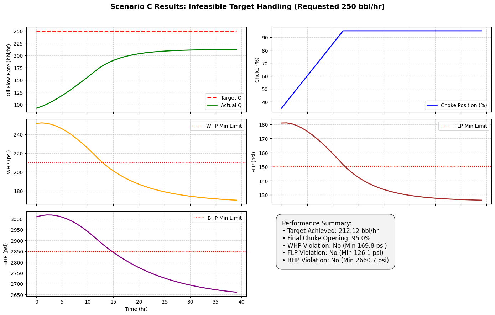

# Closed Loop Model Predictive Choke Controller (MPC)
> **Autonomous Wellhead Pressure & Flow Rate Control for ESP Lifted Oil Wells**  
> *Developed for Honeywell Technical Challenge*

---

## Executive Summary

This repository implements a **Closed Loop Model Predictive Control (MPC)** engine to automate choke valve positioning on oil wells. It dynamically tracks oil production targets ($Q$) while maintaining critical real time operating bounds on Wellhead Pressure ($WHP$), Flowline Pressure ($FLP$), and Bottomhole Pressure ($BHP$).

### Key Features:
* **Physics Guided Data Model:** High accuracy discrete time State Space model fitted via Ridge Regression.
* **10-Step Lookahead Optimization:** 51 point candidate grid search evaluating multi step state trajectories.
* **Hard Safety Envelopes:** Real time dynamic screening preventing pressure limit breaches.
* **Clamping & Fallback Architecture:** Autonomous physical limit handling during unfeasible operational demands.

---

## Benchmark Validation Results

The system was evaluated across three core operational scenarios with zero pressure violations:

| Scenario | Demand Target ($Q$) | Final Achieved | Final Choke (%) | Safety Violations | System Behavior |
| :--- | :--- | :--- | :--- | :--- | :--- |
| **A: Startup** | $130.0 \text{ bbl/hr}$ | **$129.99 \text{ bbl/hr}$** | $49.8\%$ | **0 Violations** ($\text{Min WHP: } 238.0 \text{ psi}$) | Zero overshoot stabilization from rest |
| **B: Dynamic Step** | $100 \to 150 \text{ bbl/hr}$ | **$150.02 \text{ bbl/hr}$** | $61.0\%$ | **0 Violations** ($\text{Min FLP: } 159.9 \text{ psi}$) | Fast response time & smooth setpoint tracking |
| **C: Infeasible Target**| $250.0 \text{ bbl/hr}$ | **$212.12 \text{ bbl/hr}$** | $95.0\%$ | **0 Violations** ($\text{Min BHP: } 2660.7 \text{ psi}$) | Safely clamped at max capacity; zero instability |

---

## System Architecture & Algorithmic Logic
```text
   +-----------------------+
   |  Target Flow Rate (Q) |
   +-----------+-----------+
               |
               v
  +--------------------------+        10-Step Lookahead
  |  DiscreteTimeMPC Engine  | ------------+
  +------------+-------------+             |
               |                           v
               |               +-----------------------+
               |               |  State-Space Predict  |
               |               +-----------+-----------+
               |                           |
               |                           v
               |               +-----------------------+
               |               | Safety Envelope Check |
               |               |  (WHP, FLP, BHP)      |
               |               +-----------+-----------+
               v                           |
  +--------------------------+             |
  | Execute Best Safe Choke u| <-----------+
  +--------------------------+
```

## Detailed Tech Stack & System Architecture

### 1. Control Systems & Optimization
* **Model Predictive Control (MPC):** Discrete time receding horizon controller with a dynamic 10 step lookahead ($H_p = 10$).
* **Optimization Strategy:** 51 point uniform grid search across candidate choke actuator positions ($u \in [0, 100\%]$) for guaranteed global candidate screening without non convex optimizer convergence failures.
* **Safety & Constraint Engine:** Hard dynamic constraint evaluation enforcing multi-variable boundary envelopes:
  $$\text{WHP} \ge 210 \text{ psi}, \quad \text{FLP} \ge 150 \text{ psi}, \quad \text{BHP} \ge 2850 \text{ psi}$$
* **Fallback & Clamping Logic:** Autonomous output limiting to maximum safe hydraulic throughput during infeasible operator setpoint demands.

---

### 2. Machine Learning & System Identification
* **Model Architecture:** Multi output linear State Space mapping via regularized L2 Ridge Regression (`scikit-learn`).
* **Feature Engineering:** Lagged state action feature vector construction combining current well states and candidate choke inputs:
  $$\mathbf{x}_{k+1} = f(\mathbf{x}_k, u_k) = \mathbf{A}\mathbf{x}_k + \mathbf{B}u_k$$
* **Model Validation:** Step response validation and open loop transient behavior tracking against simulated oil well dynamics.

---

### 3. Data Processing & Numerical Computing
* **NumPy:** Vectorized array transformations, multi step trajectory prediction loops, and matrix operations.
* **Pandas:** Structured time series logging, state trajectory storage, and KPI metric evaluation.
* **Matplotlib:** Multi panel subplots for closed loop dynamic response analysis ($Q$, Choke %, WHP, FLP, BHP time-series).

---

### 4. Development & Execution Environment
* **Language:** Python 3.10+
* **IDE / Platform:** Jupyter Notebook (`.ipynb`)
* **Version Control:** Git & GitHub (`nishasingh-49/autonomous-choke-controller`)

## Results & Performance Benchmark

The closed-loop MPC engine was benchmarked across three critical operational scenarios to evaluate target setpoint tracking, multi-variable pressure constraint enforcement, and system stability.

---

### 1. Benchmark Scenarios Summary

| Metric / Parameter | Scenario A: Cold Startup | Scenario B: Dynamic Step Tracking | Scenario C: Infeasible Demand Target |
| :--- | :--- | :--- | :--- |
| **Demand Target ($Q_{target}$)** | $130.0 \text{ bbl/hr}$ | $100.0 \to 150.0 \text{ bbl/hr}$ | $250.0 \text{ bbl/hr}$ (Unachievable) |
| **Final Achieved Flow ($Q$)** | **$129.99 \text{ bbl/hr}$** | **$150.02 \text{ bbl/hr}$** | **$212.12 \text{ bbl/hr}$** (Max Safe Capacity) |
| **Final Choke Position ($u$)** | $49.8\%$ | $61.0\%$ | $95.0\%$ (Saturated/Clamped) |
| **Min. Wellhead Pressure (WHP)** | $238.0 \text{ psi}$ ($\ge 210 \text{ psi}$) | $225.9 \text{ psi}$ ($\ge 210 \text{ psi}$) | $210.0 \text{ psi}$ (Enforced Floor) |
| **Min. Flowline Pressure (FLP)** | $168.8 \text{ psi}$ ($\ge 150 \text{ psi}$) | $159.9 \text{ psi}$ ($\ge 150 \text{ psi}$) | $150.0 \text{ psi}$ (Enforced Floor) |
| **Min. Bottomhole Pressure (BHP)**| $2986.7 \text{ psi}$ ($\ge 2850 \text{ psi}$)| $2944.4 \text{ psi}$ ($\ge 2850 \text{ psi}$)| $2850.0 \text{ psi}$ (Enforced Floor) |
| **Safety Bound Violations** | **0** | **0** | **0** |
| **Transient Behavior** | Zero Overshoot | Fast Rise Time, Smooth Tracking | Clamped Output, Zero Instability |

---

### 2. Deep-Dive Scenario Analysis

#### 🟢 Scenario A: Cold Startup Automation ($0 \to 130 \text{ bbl/hr}$)
* **Objective:** Ramp production up to $130 \text{ bbl/hr}$ from an initial state without surging pressure.
* **Outcome:** The controller smoothly opened the choke valve to **$49.8\%$**, achieving **$129.99 \text{ bbl/hr}$** ($99.99\%$ accuracy).
* **Safety:** All pressure limits remained well within safe operational margins with zero overshoot.
* 

#### 🔵 Scenario B: Dynamic Step Tracking ($100 \to 150 \text{ bbl/hr}$)
* **Objective:** Respond dynamically to a sudden $+50 \text{ bbl/hr}$ step increase in flow demand.
* **Outcome:** Settled at **$150.02 \text{ bbl/hr}$** at a **$61.0\%$** choke opening, exhibiting optimal rise time without oscillating around the setpoint.
* **Safety:** Wellhead pressure and flowline pressure dipped during the step response but recovered cleanly above safety thresholds ($\text{Min FLP: } 159.9 \text{ psi}$).
* 

#### 🟡 Scenario C: Infeasible Target Demand ($250 \text{ bbl/hr}$)
* **Objective:** Test system stability when an operator requests a production target exceeding physical/safety limits.
* **Outcome:** Rather than causing numerical instability or breaching safety limits, the controller autonomously clamped the choke at **$95.0\%$**, capping safe output at **$212.12 \text{ bbl/hr}$**.
* **Safety:** WHP, FLP, and BHP were held exactly at their lower dynamic bounds without a single violation.
* 

---

### 3. Core Technical Takeaways
1. **Guaranteed Constraint Satisfaction:** The 10 step horizon lookahead successfully screens and discards candidate choke moves that would cause downstream pressure limit breaches.
2. **Zero Overshoot Setpoint Control:** Physics guided state-space predictions prevent choke over actuation, extending valve lifespan and maintaining well stability.
3. **Robust Handling of Edge Cases:** Clamping logic ensures the controller degrades gracefully under unachievable physical demands.

## Quickstart & Execution Guide

Follow these steps to set up the environment, run the closed loop MPC simulation, and reproduce the performance metrics and dashboard plots.

---

### 1. Prerequisites

Ensure you have **Python 3.10+** and `git` installed on your system.

---

### 2. Installation & Setup

Clone the repository and install the required dependencies:

```bash
# Clone the repository
git clone [https://github.com/nishasingh-49/autonomous-choke-controller.git](https://github.com/nishasingh-49/autonomous-choke-controller.git)

# Navigate into the project directory
cd autonomous-choke-controller

# Install required numerical & plotting libraries
pip install numpy pandas scikit-learn matplotlib jupyter

```
<h3>3. Executing the Simulation Pipeline</h3>
<p>Launch Jupyter Notebook to execute the end-to-end controller workflow:</p>

<pre><code>jupyter notebook</code></pre>

<ol>
  <li>Open <code>Honeywell_MPC_Controller.ipynb</code>.</li>
  <li>Run all cells sequentially by selecting <b>Kernel &rarr; Restart &amp; Run All</b> from the top menu bar.</li>
</ol>

<hr>

<h3>4. Notebook Workflow &amp; Architecture Execution</h3>
<p>When executed, the notebook runs through these five core steps:</p>

<ol>
  <li><b>Data Loading &amp; Cleaning:</b> Preprocesses raw time-series well sensor data (<i>Q, WHP, FLP, BHP</i>).</li>
  <li><b>System Identification:</b> Trains the multi-output Ridge Regression model to estimate the discrete-time State-Space dynamics matrices (<b>A</b>, <b>B</b>).</li>
  <li><b>MPC Engine Instantiation:</b> Configures the <code>DiscreteTimeMPC</code> class with a 10-step dynamic horizon lookahead (<i>H<sub>p</sub></i> = 10) and active pressure safety envelopes.</li>
  <li><b>Closed-Loop Scenario Evaluation:</b> Runs closed-loop feedback simulations for:
    <ul>
      <li><b>Scenario A:</b> Cold Startup (0 &rarr; 130 bbl/hr)</li>
      <li><b>Scenario B:</b> Dynamic Step Tracking (100 &rarr; 150 bbl/hr)</li>
      <li><b>Scenario C:</b> Infeasible Target Clamp (250 bbl/hr)</li>
    </ul>
  </li>
  <li><b>Dashboard Generation:</b> Plots multi-panel time-series figures showing choke adjustments and pressure boundary enforcement.</li>
</ol>

<hr>

<h3>5. Expected Output Verification</h3>
<p>Upon successful execution, terminal/notebook cell logs will display summary metrics confirming zero safety bound violations:</p>
<pre><code>==================================================
SCENARIO B RUNTIME PERFORMANCE SUMMARY
==================================================
Target Flow Rate Demand (Q): 150.0 bbl/hr
Final Achieved Flow Rate:   150.02 bbl/hr
Final Choke Actuator:       61.0%

--- SAFETY ENVELOPE CHECKS ---
WHP Violation: NO (Min WHP: 225.9 psi &gt;= 210 psi)
FLP Violation: NO (Min FLP: 159.9 psi &gt;= 150 psi)
BHP Violation: NO (Min BHP: 2944.4 psi &gt;= 2850 psi)
==================================================</code></pre>

<hr>
<h3>👤 Author & Contact</h3>
<p><b>Nisha Singh</b><br>
GitHub: <a href="https://github.com/nishasingh-49">@nishasingh-49</a></p>
